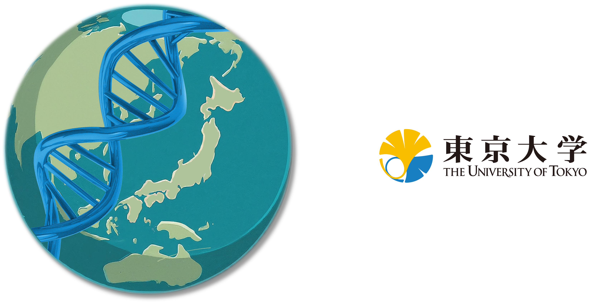
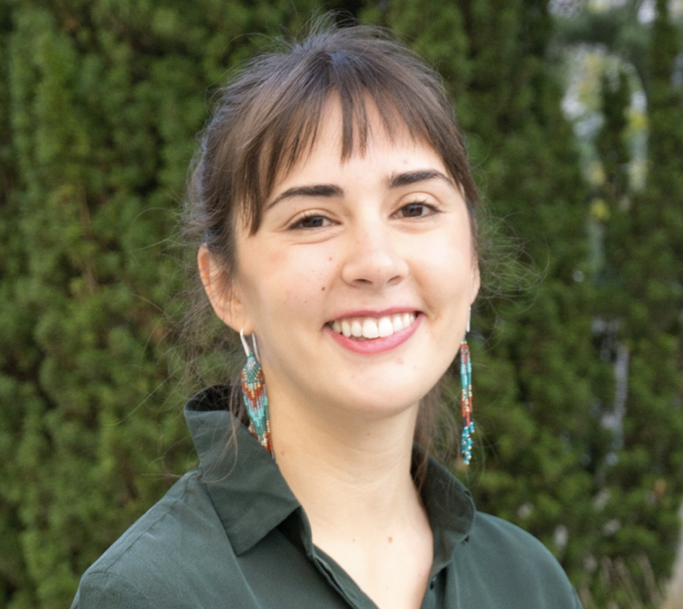
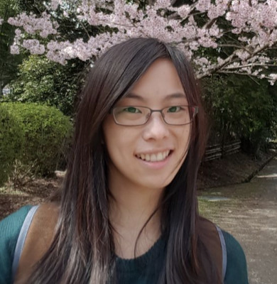
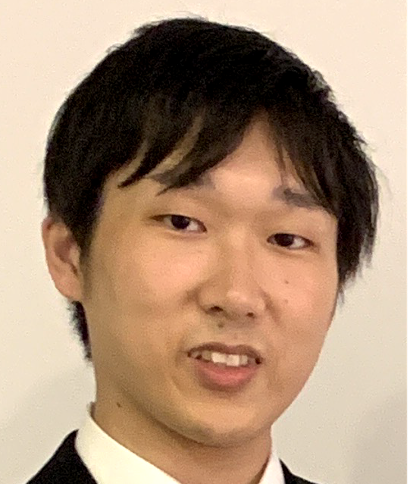
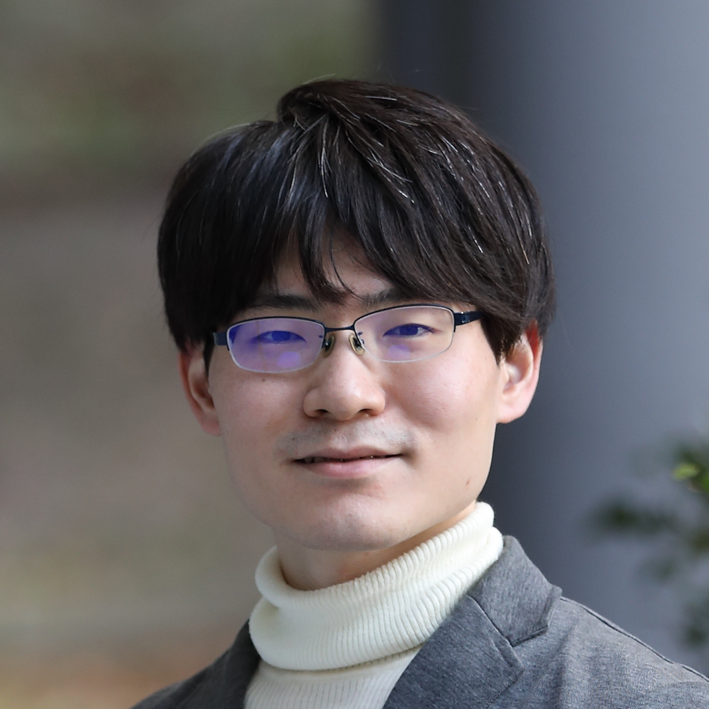

# **Polygenic Risk Score Workshop - Japan**
<figure markdown>{width=70%}</figure>
**2-Day Summer PRS Workshop: 31 August - 1 September 2024**

The University of Tokyo, Japan
   
**Hands-on training on the latest methods, software tools and applications for polygenic risk scores (PRS) analyses.**

### **Summary**

The recent increase in large-scale genome-wide association study (GWAS) and genomic biobank data collections (e.g. Biobank Japan, UK Biobank, All Of Us) is providing unprecedented opportunities for in-depth understanding of the causes and prediction of human diseases. As genomic data from multi-ancestry population studies continues to grow, it is imperative that scientists are empowered with the skills to analyse these data using the latest tools and approaches for advancing research and genomics applications globally. 

This short course will train scientists with computational tools and the latest approaches required to perform polygenic risk scores (PRS) analyses. The course will cover both theoretical and applied topics in PRS research and will be delivered across a variety of tutorials, lectures and computational practicals. The course will also involve many opportunities to discuss the topics with the tutors and with other workshop participants, and so this is also a great networking opportunity. By the end of the workshop, attendees should have an in-depth theoretical understanding and practical skills in PRS analysis of global populations. 

The course will begin with a brief overview of GWAS, an introduction to PRS analysis, advanced topics in PRS (e.g., pathway-based PRS, PRS*Environment interactions, PRS to identify rare variants). This will be followed by introducing and then investigating the critically important topic of the ‘PRS Portability Problem’, in which PRS are known to generalise less well between population of different ancestry. Workshop participants will learn how to address this using the latest PRS methods developed for application to diverse and admixed ancestry samples, including PRS-CSx and BridgePRS.

###**Target audience**

Students and scientists based inside or outside of Japan interested in the theory and/or application of polygenic risk scores, important for those undertaking research in: Bioinformatics, Genetic Epidemiology, Population Genetics, Statistical Genetics, Clinical Genetics, Quantitative Genetics.

##**Programme**
The course will take place over 2 days and will include lectures, tutorials and computational practicals. There will be multiple opportunities to meet the training team in a 1:1 setting, and to interact with other attendees and the workshop team throughout the weekend, helping to foster a supportive, collegiate and interactive environment to maximise learning for all.

###Topics overview

* Overview of GWAS: GWAS basics and GWAS for PRS
* Introduction to PRS: calculating PRS, running PRS software, interpreting PRS results
* Advanced PRS topics: pathway-based PRS, PRS for G*E interaction, PRS to detect rare variants
* PRS in diverse ancestries: the PRS Portability Problem, PRS methods for addressing portability problems, PRS for diverse and admixed population samples

###**Learning outcomes**
At the end of the course, participants will be able to:

* Discuss the application of GWAS and PRS methods to understand disease aetiology and the interplay between genetics and the environment
* Explain the application of PRS in determination of complex disease genetic risk 
* Perform essential steps for PRS analysis using standard approaches and tools
* Apply relevant tools and software to analyse complex global (diverse and admixed) population genomics datasets (e.g. [PRS-CSx](https://www.nature.com/articles/s41588-022-01054-7), [BridgePRS](https://www.nature.com/articles/s41588-023-01583-9))
* Evaluate and interpret results generated from PRS analyses
* Customise visualisation of results from PRS analyses

##Instructors and speakers
###**Scientific Organizing Committee**

- <figure markdown>{width=60%}</figure>
    
 [Yukinori Okada](https://www.u-tokyo.ac.jp/focus/en/people/k0001_00120.html) 

    
The University of Tokyo

- <figure markdown>{width=60%}</figure>
    
    
[Paul O'Reilly](https://labs.icahn.mssm.edu/oreillylab/)

    
Icahn School of Medicine at Mount Sinai, USA 

###**Training Team**

- <figure markdown>{width=60%}</figure>
    
 [Clive Hoggart](https://labs.icahn.mssm.edu/oreillylab/)

    
Icahn School of Medicine, USA 

- <figure markdown>{width=60%}</figure>
    
    
[Judit García-González](https://labs.icahn.mssm.edu/oreillylab/)

    
Icahn School of Medicine, USA 

- <figure markdown>{width=60%}</figure>
    
 [Beatrice Wu](https://labs.icahn.mssm.edu/oreillylab/)

    
 Icahn School of Medicine, USA  

- <figure markdown>{width=60%}</figure>
    
 Yoshihiko Tomofuji 

    
The University of Tokyo 

- <figure markdown>{width=55%}</figure>
    
    
Shinichi Namba

    
The University of Tokyo 

- <figure markdown>{width=60%}</figure>
    
Kyuto Sonehara

    
 The University of Tokyo  

##How to Apply
Please download, and fill out the [Registration Form](img/JapanPRS2024_AppForm.docx){:JapanPRS2024_AppForm}, and then email it to xxx@gmail.com. 
If you have any questions or any problems with the application process, please [contact us](xxx@gmail.com).

 
 
 

