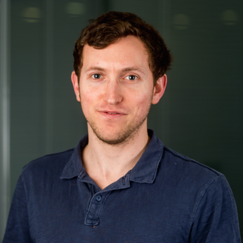

# **Polygenic Risk Score Analysis - Japan**

**31 August - 1 September 2024**

The University of Tokyo, Japan

**Hands-on training on the latest tools and approaches for polygenic risk scores (PRS) analysis.**

### **Summary**

The boost in collections of genomic Biobanks is providing opportunities for further in-depth understanding of the causes of human diseases. As genomic data from cross population studies continues to grow, it is imperative that scientists are empowered with skills to analyse these data using the latest tools and approaches for advancing research and genomics applications globally. 

This short course will equip scientists with tools and approaches for polygenic risk scores (PRS) analysis. The course will cover both applied and theoretical topics in PRS research, delivered across a variety of lectures, tutorials, computational practicals and special guest seminars from experts in the field. By the end of the workshop, attendees should have an in-depth theoretical understanding and practical skills in PRS analysis of global populations. 

The course will begin with an overview of genome-wide association studies, an introduction to PRS analysis, advanced topics in PRS (e.g., pathway-based PRS, PRS*Environment interactions, PRS to identify rare variants). This will be followed by the key topic of the ‘PRS Portability Problem’ and how to address it using PRS methods developed for application to diverse and admixed ancestry samples. Finally, attendees will devise, perform and present their own research project as part of a group on a topic relevant to the content of the course, with feedback from the workshop team. 

###**Target audience**

Students and scientists based in Japan and (other Asian countries?) interested in the theory and/or application of polygenic risk scores, important for those undertaking research in: Bioinformatics, Genetic Epidemiology, Population Genetics, Statistical Genetics, Clinical Genetics, Quantitative Genetics.

##**Programme**
The course will run over 2 days and will include lectures, tutorials, computational practicals and special guest seminars from experts in the field. There will be multiple opportunities to meet the training team on 1:1 setting, and to interact with other attendees and the workshop team throughout the week, helping to foster a supportive, collegiate and interactive environment to maximise learning for all.

###Topics overview

* Overview of GWAS: GWAS basics and GWAS for PRS
* Introduction to PRS: calculating PRS, running PRS software, interpreting PRS results
* Advanced PRS topics: pathway PRS, PRS for G*E interaction, PRS to detect rare variants
* PRS in diverse ancestries: the PRS Portability Problem, PRS methods for addressing portability problems, PRS for diverse and admixed population samples

###**Learning outcomes**
At the end of the course, participants will be able to:

* Discuss the application of GWAS and PRS methods to understand disease aetiology and the interplay between genetics and the environment
* Explain the application of PRS in determination of complex disease genetic risk 
* Perform essential steps for PRS analysis using standard approaches and tools
* Apply relevant tools and software to analyse complex global (diverse and admixed) population genomics datasets (e.g. [PRS-CSx](https://www.nature.com/articles/s41588-022-01054-7), [BridgePRS](https://www.nature.com/articles/s41588-023-01583-9))
* Evaluate and interpret results generated from PRS analyses
* Customise visualisation of results from PRS analyses

##Instructors and speakers
###**Scientific Organsing Committee**

- <figure markdown>{width=60%}</figure>
    
 [Yukinori Okada](https://www.u-tokyo.ac.jp/focus/en/people/k0001_00120.html) 

    
The University of Tokyo

- <figure markdown>{width=60%}</figure>
    
    
[Paul O'Reilly](https://labs.icahn.mssm.edu/oreillylab/)

    
Icahn School of Medicine at Mount Sinai, USA 

###**Training Team**

- <figure markdown>{width=60%}</figure>
    
 [Clive Hoggart](https://labs.icahn.mssm.edu/oreillylab/)

    
Icahn School of Medicine, USA 

- <figure markdown>{width=60%}</figure>
    
    
[Judit García-González](https://labs.icahn.mssm.edu/oreillylab/)

    
Icahn School of Medicine, USA 

- <figure markdown>{width=60%}</figure>
    
 [Beatrice Wu](https://labs.icahn.mssm.edu/oreillylab/)

    
 Icahn School of Medicine, USA  

- <figure markdown>{width=50%}</figure>
    
 Clive Hoggart 

    
Icahn School of Medicine, USA 

- <figure markdown>{width=50%}</figure>
    
    
Judit García-González

    
Icahn School of Medicine, USA 

- <figure markdown>{width=50%}</figure>
    
 Beatrice Wu

    
 Icahn School of Medicine, USA  

##How to Apply
Ask Paul

